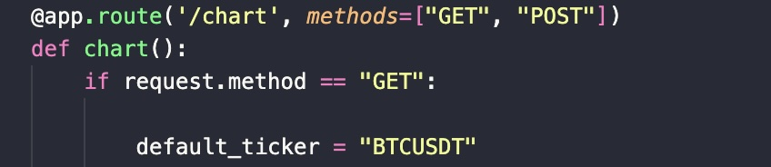

**Tijdens de code review kwamen er een aantal punten naar voren.**

1) Er zaten inconsistenties in het aantal witregels in de code. 

2) Er missen docstrings in de functies

3) Ik had meer gebruik moeten maken van groeperingen van code blocks

4) Ik had de chart classes niet in 1 file moeten zetten maar 1 file per class

5) Ik had comments moeten gebruiken voor de .css en .html files het ziet er rommelig uit

6) Het is misschien handig om, in plaats van alle logica in de routes te zetten, het in aparte functies te zetten die ik de routes gebruikt worden. Overzichtelijker

**Review gedaan met Mart en Joost**

**Hoe zou ik het oplossen?**

1) Ik had inderdaad nog een keer door mijn code moeten gaan toen ik klaar was om de inconsistenties eruit te halen. Misschien 
moet ik zelfs stricter zijn op stilisitische regels tijdens het coderen om het meteen goed te doen. 

2) Het zelfde verhaal geldt hier. Misschien moet ik het in de mentale routine zetten. Net als je automatisch 'def' schrijft als
je een functie maakt, moet je een docstring ook aanmaken. Dit zijn habits die het probleem oplossen. Ik denk dat ik hier dan meer op moet gaan letten. Het maakt de code wel degelijk beter om snel te begrijpen voor iemand die de code niet geschreven heeft. 

    Hier is een voorbeeld van een functie waar het mooi geweest was als er ook een docstring was.

    

3) Ik had tijdens het coderen ook moeite hiermee. Ik was een paar keer het overzicht kwijt geraakt en dit is nog een klein project. 
Ik hecht nu veel waarde aan efficient coderen en eerst dacht ik dat dat alleen speed was, maar nu begrijp ik dat overzichtelijkheid er ook bij komt kijken. Veel functies staan door elkaar en het zou mmooier staan als all functies voor een bepaald doeleinde bijelkaar stonden

4) Hier hoeft geen foto bij denk ik. classes.py, de file waar alle chart classes staan is langer dan 500 lines. Nu ik er over na denk ik dit echt onnodig gewoon. Elke class een parte file is de oplossing. Al deze files in een folder genaamd 'ChartClasses'. Dit zou het veel beter maken om structuur te behouden.

5) De css en html files hebben geen comments. Nu zijn mijn html files nog wel redelijk overzichtelijk vind ik, maar de css file is te rommelig. Hier moeten comments en groeperingen bij komen. Alle classes staan door elkaar. Het werkt wel, maar het kan veel overzichtelijker. Ik heb ook niet veel tijd gestopt in de css files. 